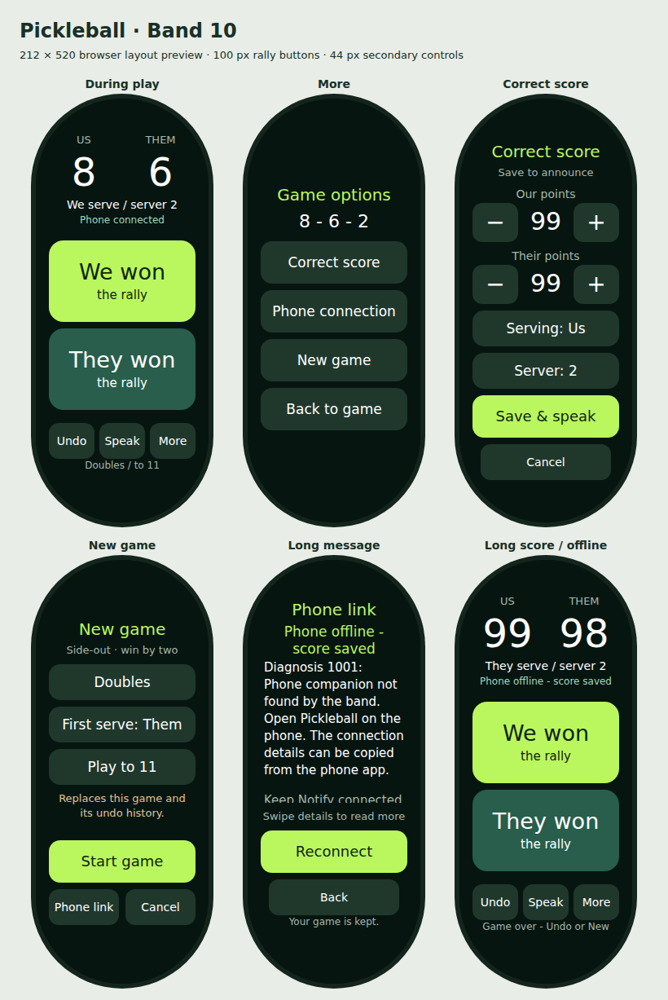

# Pickleball for Xiaomi Smart Band 10

A standalone Vela band app and Android announcer. Tasker is not required.

Download the **[Android APK and band RPK from GitHub Releases](https://github.com/mahmoodw/pickleball-band/releases)**. The release bundle also includes setup instructions and source. For this layout update, install the v0.1.4 band RPK. Your working v0.1.3 phone APK remains compatible.

**Device status:** the user reports the Notify connection and announcements working after the v0.1.3 phone fix. Version **0.1.4 improves the band layout for its 212 × 520 screen**. The new layout has been checked in a browser approximation and built with the Vela toolkit; physical-device layout and longer screen-locked sessions still need testing.

The band keeps the game and undo history locally. The phone receives score snapshots and speaks using an offline English Android voice. **Notify for Xiaomi supplies both installation and the phone/band connection. Keep Notify running and connected to the band. Mi Fitness and Tasker are not required.**

## Upgrade to v0.1.4

Update the band app through Notify using `pickleball-band-0.1.4.rpk`. **Keep your working v0.1.3 phone APK**; updating Android is optional for this UI release. The v0.1.4 APK is included for new installations. Both apps keep their package name and signing key, and the band keeps the saved-game format and communication protocol. Update the RPK in place; uninstalling first may erase the saved game.

On the band, **We won / They won** are the large rally buttons. **Undo**, **Speak**, and **More** sit below them. **More** opens corrections, new-game settings and phone connection. If needed, use **More → Phone connection → Reconnect**, then return to the game and tap **Speak**.

## Band layout

Xiaomi specifies a **212 × 520 pixel, 1.72-inch AMOLED** display for the Band 10. The app uses the same 212-pixel design width and a centered **180 × 448** content area to leave space around the rounded ends.

- The rally buttons are **180 × 100 pixels**, up from 192 × 45. Their touch area is just over twice as large, with large team labels and an 8-pixel gap.
- The three secondary game buttons are **56 × 44 pixels**. Corrections, new games and connection controls live in **More**, away from the scoring buttons.
- Score correction uses compact minus/value/plus rows. Setup and correction controls fit on screen without vertical overflow.
- Text has explicit widths, line heights and wrapping limits. Long connection details scroll independently while Reconnect and Back stay visible.



This preview uses the source template and CSS in a browser with a conservative rounded display mask. It checks sample two-digit scores, long status messages and the secondary screens; it is not a screenshot or emulator of Vela.

Notify node IDs are opaque. In v0.1.2, an empty string was incorrectly used to mean both “no selected band” and a provider-supplied route. This could show “Band app reached the phone. Waiting for score sync...” alongside “Last message send: Not attempted.” The new phone app uses `null` only for an absent route and passes Notify’s actual ID through unchanged for messages and listener cleanup. The selection diagnostic now checks whether a saved selection exists instead of requiring a nonempty ID.

In v0.1.1, “Notify is not responding” could appear after successful discovery because the discovery timer was still active during selection and an unanswered permission request. It did not establish that Notify or the band was disconnected. The new selection flow saves your choice immediately; **Request band access (if needed)** is a separate troubleshooting action for permission errors, following Notify’s demo which registers message listeners independently of device-management authorization.

## Install and connect

1. Copy `pickleball-phone-0.1.4.apk` to your Android phone and open it to install. Android 8 or newer is required. Allow installation from the file manager/browser you use if Android prompts.
2. Install or update `pickleball-band-0.1.4.rpk` through Notify's custom-app installation flow. The package is an app, not a watchface. The supplied apps have matching package names and signing certificates.
3. Open **Notify for Xiaomi** and confirm it shows your Band 10 as connected. Keep Notify running. Use a current Notify version that exposes its Interconnect service. This app does not manage pairing or require opening Mi Fitness.
4. Open **Pickleball** on the phone. Tap **Select band**, select the Band 10. Selection is complete as soon as you choose it.
5. Tap **Start announcer**, allow its notification, wait for the voice status, then tap **Test phone voice**. You should hear “zero, zero, two.” If needed, use **Voice settings** to install an offline English voice and then stop/start the announcer.
6. Open **Pickleball** on the band. Start a new game, choosing singles/doubles, who serves first and 11/15/21 points. If offline, tap **More → Phone connection → Reconnect** and wait for the displayed diagnosis. Use **Back**, wait for **Phone connected**, then tap **Speak**. The phone should read the displayed call; the band should eventually say **Score spoken**.

The announcer has an ongoing notification while active. Leave it running during play, then use **Stop announcer** or the notification's **Stop** action. Speech uses media volume and the phone's selected audio output, including connected headphones or speakers.

## During a game

- **We won / They won:** record the rally result. Under traditional side-out scoring, winning while receiving changes the server or serving side without adding a point.
- **Undo:** restore the entire previous state, including serve and server number. Up to 100 changes are retained.
- **More → Correct score:** edit either score, serving side and (in doubles) server number; **Save & speak** applies the correction once. **Cancel** discards edits.
- **Speak:** repeat the current call without changing the game.
- **More → Phone connection → Reconnect:** retry the phone handshake and show Vela’s connection diagnosis. Returning to the band app also retries immediately; while visible and waiting for the phone, it retries every eight seconds. Vela manages the physical link, so this cannot force Bluetooth pairing or restart Notify.
- **More → New game:** choose new-game settings. **Start game** replaces the current game and its undo history; **Cancel** preserves it.

Doubles calls are serving score, receiving score, server number. The opening serve is `0 - 0 - 2`. Singles uses two numbers. Corrections and undo begin with “Correction.” At a winning score, the announcement gives the final score and winner. Games use win-by-two; further rallies are blocked after a win until Undo, Correct or New. Scores are limited to 99. Rally scoring and player-position tracking are outside this prototype.

Each update is saved on the band before transmission. Updates made offline stay on the band. Reconnecting synchronizes silently, and **Speak** reads the latest score. Old changes are not replayed as a speech queue. A save failure leaves the previous game unchanged. Rapid new announcements replace speech already in progress.

## First device check

1. Confirm installation of both packages and that every band button is visible and tappable.
2. With the phone unlocked, test the voice, then score one rally from the band.
3. Lock the phone, wait a minute, and score another rally. Repeat after several minutes.
4. Test Undo and a correction affecting both points and server.
5. Disconnect the band, record a rally, reconnect and verify the current score syncs silently. Tap Speak to announce it.

If it fails, tap **Copy connection details** on the phone and include that text plus the band's **Phone link** status and diagnosis in a report. It includes the app/Android/Notify versions, whether Notify's Interconnect service is visible, connection/voice errors, the last message-send result and whether the phone has received a band message. It excludes band identifiers and keys. “Notify listener ready” means Notify accepted listener registration; “Band app connected” means a score packet was received and validated. A send accepted by Notify alone does not confirm delivery to the band. These details distinguish a missing Notify service, authorization failure, missing band communication and unavailable TTS. **Score spoken** means Android's speech engine reported completion; it cannot establish that the phone's volume was audible on court. Android battery management may need adjustment if the announcer stops while the phone is locked.

If the app says Notify is installed but its Interconnect service is unavailable, update Notify and open it, then retry. A disconnected phone does not prevent local band scoring.

## Build and test

Sources are in `band/src` and `android/src`. Both applications use `com.wmahmood.pickleball`. Build tools used here: Node 24.21.0, Xiaomi `aiot-toolkit` 2.0.5 (dependencies locked), JDK 17, Android platform 35 and build-tools 35.0.0. Android uses platform APIs and Notify's custom XMS SDK without Gradle or AndroidX.

Fetch **Notify's custom SDK** with `python3 scripts/fetch_notify_sdk.py` and install band dependencies with `npm ci` from `band/`. The official Xiaomi AAR has the same upstream filename but targets different phone services and cannot be substituted. The Android build verifies the Notify AAR's pinned SHA-256 before deriving `xms.jar`, preventing stale official SDK files from being used. Then set these environment variables to your installed tools:

```bash
export PICKLEBALL_JDK=/path/to/jdk-17
export PICKLEBALL_ANDROID_PLATFORM=/path/to/android-sdk/platforms/android-35
export PICKLEBALL_ANDROID_TOOLS=/path/to/android-sdk/build-tools/35.0.0
python3 scripts/build_android.py
```

The Android build creates a local prototype signing key and copies the matching PEM files to the band's signing directories. Next run `npm run release` from `band/`. Android output is in `dist/`; band output is in `band/dist/`.

Keep `sign/` and `band/sign/` private and preserve them for updates to an installed pair. They are deliberately excluded from the distributable source archive. Rebuilding without those keys creates a new signing identity; Android will require removal of an older differently signed build before installing it. Do not uninstall the band app to update it without first noting the current score, because uninstallation may erase the saved game.

Run `npm test` at the project root for the 17 scoring and band-controller tests, including reconnect/resume, saved-game preservation, stale callbacks and diagnosis errors. For the Android score/protocol tests, download `org.json:json:20240303` from Maven Central as a JVM-only test dependency, then run:

```bash
"$PICKLEBALL_JDK/bin/javac" -cp /path/to/json-20240303.jar -d build/java-tests android/src/com/wmahmood/pickleball/Score.java android/src/com/wmahmood/pickleball/MessageOrder.java tests/ScoreTest.java
"$PICKLEBALL_JDK/bin/java" -cp build/java-tests:/path/to/json-20240303.jar com.wmahmood.pickleball.ScoreTest
```

Those 25 checks exercise score syntax, corrections, game-over calls, input validation, duplicate/out-of-order delivery and silent synchronization before speech. They do not emulate Notify or a physical wearable.

Run the discovery/selection callback regressions without Android dependencies:

```bash
"$PICKLEBALL_JDK/bin/javac" -d build/java-tests android/src/com/wmahmood/pickleball/BandSelection.java tests/BandSelectionTest.java
"$PICKLEBALL_JDK/bin/java" -cp build/java-tests com.wmahmood.pickleball.BandSelectionTest
```

These checks cover successful selection followed by the old discovery timeout, time spent in the chooser, overlapping requests, cancellation, errors and retry.

The Android reply/cleanup regression uses the real service methods with SDK/preference test doubles. It checks empty-ID hello replies, sync/speech acknowledgments, listener cleanup, ordinary IDs and detached routing. It runs on JDK 17 with the Android compile-time stubs and the same JVM JSON dependency:

```bash
"$PICKLEBALL_JDK/bin/javac" -cp "/path/to/json-20240303.jar:$PICKLEBALL_ANDROID_PLATFORM/android.jar:android/libs/xms.jar" -d build/transport-tests android/src/com/wmahmood/pickleball/*.java tests/ScoreTest.java tests/AndroidTransportTest.java
"$PICKLEBALL_JDK/bin/java" -cp "build/transport-tests:/path/to/json-20240303.jar:$PICKLEBALL_ANDROID_PLATFORM/android.jar:android/libs/xms.jar" com.wmahmood.pickleball.AndroidTransportTest
```

The test skips Android constructors with JDK 17's `Unsafe` solely to instantiate its test doubles; it does not emulate a phone, Notify service or Bluetooth connection.

After fetching the SDK, run `python3 -m unittest discover -s tests -p 'test_*.py'` to verify the provider library and Android package visibility agree. No real-device connection is emulated by these tests.

To regenerate the browser layout preview, run `node scripts/preview_band.cjs` with Playwright and its Chromium browser installed. If Playwright is installed separately, set `PICKLEBALL_PLAYWRIGHT` to its module path. The script writes the preview PNG in `docs/`, an HTML copy in `build/`, and reports text overflow outside the intentional connection-details scroll area. It does not emulate Vela rendering.

## References

- [Xiaomi Smart Band 10 display specifications](https://www.mi.com/global/product/xiaomi-smart-band-10/specs/)
- [Xiaomi Interconnect documentation and SDK/demo download](https://iot.mi.com/vela/quickapp/en/features/network/interconnect.html)
- [Notify's custom Interconnect SDK, Android demo and integration instructions](https://www.mibandnotify.com/xiaomi-mi-band/notify-xms-app-instructions.php)
- [Xiaomi Vela app documentation](https://iot.mi.com/vela/quickapp/en/)
- [Notify wearable apps](https://www.mibandnotify.com/xiaomi-mi-band/notify-app.php)

See `THIRD_PARTY.md` for external components.
