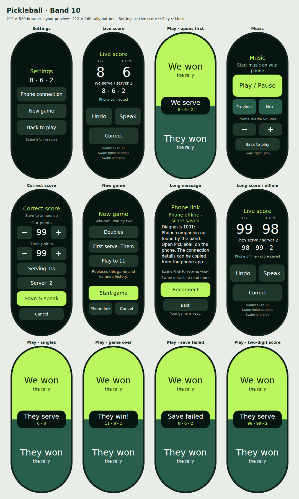

# Pickleball for Xiaomi Smart Band 10

A standalone Vela band app and Android announcer. Tasker is not required.

Download the **[Android APK and band RPK from GitHub Releases](https://github.com/mahmoodw/pickleball-band/releases)**. The release bundle also includes setup instructions and source. **Update both apps to v0.1.11 for announcements without added waits in duck mode and tap/hold controls on the band’s center score area.**

**Device status:** the user reports the Notify connection and announcements working. Version **0.1.11 removes added delays when Pause music is off and adds a live score plus tap-to-speak/hold-to-undo on Play**. Audio and gesture regressions pass; real-device touch behavior and Bluetooth latency still need checking.

The band keeps the game and undo history locally. The phone receives score snapshots and speaks using an offline English Android voice. **Notify for Xiaomi supplies both installation and the phone/band connection. Keep Notify running and connected to the band. Mi Fitness and Tasker are not required.**

## Upgrade to v0.1.11

Install `pickleball-phone-0.1.11.apk` over the existing phone app and update the band through Notify with `pickleball-band-0.1.11.rpk`. The phone update removes added waits in duck mode; the band update adds the center-area score and gestures. Existing settings are retained, with the saved settling gap now used only when Pause music is on. Both apps keep their package names, signing keys and saved-game format. Update in place; uninstalling first may erase settings or the saved game.

When a rally passes serve to the other team, the phone says **“Turnover” before the new score**. For example, losing serve at 4–2 on server 2 produces **“Turnover. Two. Four. One.”** In doubles this includes the opening 0–0–2 side-out; switching from server 1 to server 2 on the same team does not say turnover. Singles announces turnover whenever the serving team changes after a rally. The band marks the event in the score message, so the phone does not need to have received the preceding rally.

The app opens on **Play**, with We won covering the top half and They won covering the bottom half. The serving team and live score appear over the center seam. **Tap the middle area to speak the score; long-press it to undo once.** The existing labels stay free of gesture instructions. **Swipe right for Live score**, with the running scores, Undo, Speak and Correct. **Swipe right again for Settings**, with Phone connection and New game. **Swipe left from Play for Music**. Settings no longer has a music shortcut.

The page order is **Settings ↔ Live score ↔ Play ↔ Music**. Swipe left from Live score to resume play, or use **Back to play** in Settings/Music. Undo on Live score and saved corrections stay there; a center-area undo stays on Play. Starting a new game opens Play.

Open **Announcement volume** on the phone, enable **Raise volume for announcements**, choose whether to **Pause music during announcements**, and use **Save & test**. In pause mode, the gap slider moves in **25 ms steps**, with **− 25 ms / + 25 ms** buttons for exact adjustments. With Pause music off, these controls are disabled and the app adds no announcement delay. If 250 ms is too short and 500 ms too long, try **350 ms** or **375 ms**. Saved values are retained; the default gap remains 500 ms.

## Announcement volume

The normal phone media slider controls music between announcements. **Raise volume for announcements** and **Pause music during announcements** are independent settings:

| Raise volume | Pause music | During a call |
| --- | --- | --- |
| On | On | Ask music to pause, then boost only after playback stops. |
| On | Off | Request ducking, boost and start speech without added waits. |
| Off | On | Ask music to pause and speak at the current media level. |
| Off | Off | Request ducking and immediately start speech at the current media level. |

**Ducking is a request, not a background-volume setting.** Android and the music player determine how much music is reduced. Pickleball cannot set another app's playback gain. Raising shared media volume also amplifies any music still playing, so a large boost can offset the ducking reduction. Some players pause even when asked to duck, and others may not duck. Try a modest announcement level with **Save & test** on the intended Bluetooth speaker; use pause mode if music remains too loud. There is no adjustable ducking-depth slider because the standard Android APIs do not provide that control over another app.

With **Pause music on**, Pickleball:

1. Requests a pause and waits up to 1.5 seconds for playback to stop.
2. Waits the chosen speaker gap to let buffered music drain.
3. If boost is enabled, raises media volume to the chosen level only if it is higher than the current level, then waits the gap again before speaking.
4. Restores the original media volume after speech, waits the gap, then releases audio focus so the player can resume.

With **Pause music off**, the app requests ducking, applies any volume boost and starts TTS immediately. It does not add a lead-in, a speaker-settling gap or a post-speech delay. Completion still restores the original volume before releasing focus. Android TTS, the music player and Bluetooth retain their own latency; speaker volume changes may arrive after the speech starts. Ducking depth still depends on Android and the player.

The pause-mode gap is adjustable from **250 to 1500 ms in 25 ms steps**. It applies at each settling stage, so it is not the total announcement delay. Increase it if the Bluetooth speaker changes level slowly. If music stays active or resumes before speech starts in pause mode, the boost is skipped. In duck mode, active music is expected and does not block the boost. The saved gap is preserved while its controls are disabled.

Speech explicitly uses TTS volume **1.0**, Android's default maximum relative to the selected media level. The announcement percentage refers to the media slider, not a percentage increase in perceived loudness. Zero media volume stays muted; fixed-volume outputs are not changed. Bluetooth absolute volume normally links the phone and speaker controls. A separate hardware gain knob is not adjusted by the app.

Completion, cancellation, TTS failures, a missing completion callback and normal service shutdown restore the temporary level before releasing focus. Rapid new scores replace pending calls and do not reuse an elevated level as the music baseline. A manual volume change is preserved; a detected output change cancels speech and avoids writing the old speaker's volume into the new output. Force-stopping or killing the process can prevent cleanup, and an output disconnected while boosted may retain its last level. Music buttons interrupt an active call and operate after its local music level is restored.

On upgrade, existing boosted calls keep requesting a pause, while existing unboosted calls keep requesting ducking. The new Pause music switch then lets you select either behavior independently.

## Music controls

1. Keep Notify connected and the Pickleball phone announcer running.
2. Start music or a podcast in your preferred Android player.
3. Swipe left on the band's Play page. Use **Play / Pause**, **Previous**, **Next**, and the media-volume **− / +** buttons.
4. Swipe right or tap **Back to play** to continue scoring. The game and undo history are preserved.

The phone sends standard Android media-key events to the active or most recently used media session. Player support varies; Previous may restart the current track. The band reports **control sent**, which confirms dispatch on the phone, not that playback changed. This version does not display track titles or playback state. It needs no notification-access permission or Tasker setup. The music-page volume buttons adjust the normal phone media level. The optional announcement setting temporarily raises it during calls using the chosen pause/duck mode; some audio outputs have fixed volume.

Music commands use their own acknowledgments and sequence numbers. Duplicate messages cannot toggle playback twice within the same connection, and offline commands are not queued or automatically retried. Swiping uses Vela's native horizontal pager, with a drag guard to prevent rally taps during a swipe. A native band workout still prevents opening Pickleball; this release adds music controls inside Pickleball only.

## Band layout

Xiaomi specifies a **212 × 520 pixel, 1.72-inch AMOLED** display for the Band 10. The Play page fills that display; secondary pages use 448 pixels of centered content height with text inset from the rounded ends.

- Each rally button is **212 × 260 pixels**: We won above, They won below. A **176 × 64** serve badge overlays their seam. The badge shows the serving team above the score in call order (including server number in doubles). Tap to speak, or long-press to undo one change while staying on Play. A long press consumes the release click, so it does not also repeat the score or record a rally. A winner or save error replaces the upper label while the current score remains visible.
- Live score shows both team scores, the serving side/server, the spoken score order and phone status. **Undo** and **Speak** are each **96 × 64 pixels**; **Correct** is **180 × 60**.
- The native horizontal pager contains **Settings → Live score → Play → Music**, with Play selected on opening. Swipes guard against accidental rally, edit or music actions; scoring controls only act on their own page.
- Center-area undo stays on Play; the separate Undo button and saved corrections stay on Live score. Cancel returns to the page that opened the form. New games open Play. Phone-connection details return to the page you came from.
- Correction and setup controls fit without vertical overflow. Long connection details scroll independently while Reconnect and Back stay visible.



This preview uses the source template and CSS in a browser with a conservative rounded display mask. It checks button halves, serve-badge alignment, two-digit scores, long status messages and the secondary screens; it is not a screenshot or emulator of Vela.

Notify node IDs are opaque. In v0.1.2, an empty string was incorrectly used to mean both “no selected band” and a provider-supplied route. This could show “Band app reached the phone. Waiting for score sync...” alongside “Last message send: Not attempted.” The new phone app uses `null` only for an absent route and passes Notify’s actual ID through unchanged for messages and listener cleanup. The selection diagnostic now checks whether a saved selection exists instead of requiring a nonempty ID.

In v0.1.1, “Notify is not responding” could appear after successful discovery because the discovery timer was still active during selection and an unanswered permission request. It did not establish that Notify or the band was disconnected. The new selection flow saves your choice immediately; **Request band access (if needed)** is a separate troubleshooting action for permission errors, following Notify’s demo which registers message listeners independently of device-management authorization.

## Install and connect

1. Copy `pickleball-phone-0.1.11.apk` to your Android phone and open it to install. Android 8 or newer is required. Allow installation from the file manager/browser you use if Android prompts.
2. Install or update `pickleball-band-0.1.11.rpk` through Notify's custom-app installation flow. The package is an app, not a watchface. The supplied apps have matching package names and signing certificates.
3. Open **Notify for Xiaomi** and confirm it shows your Band 10 as connected. Keep Notify running. Use a current Notify version that exposes its Interconnect service. This app does not manage pairing or require opening Mi Fitness.
4. Open **Pickleball** on the phone. Tap **Select band**, select the Band 10. Selection is complete as soon as you choose it.
5. Tap **Start announcer**, allow its notification, wait for the voice status, then tap **Test phone voice**. You should hear “zero, zero, two.” If needed, use **Voice settings** to install an offline English voice and then stop/start the announcer.
6. Open **Pickleball** on the band. Start a new game, choosing singles/doubles, who serves first and 11/15/21 points. From Play, swipe right for **Live score**. If offline, tap the phone status to open **Phone link → Reconnect**, or swipe right again for **Settings → Phone connection**. Return with **Back**, wait for **Phone connected** on Live score, then tap **Speak**. The phone should read the displayed call; the band should eventually say **Score spoken**.

The announcer has an ongoing notification while active. Leave it running during play, then use **Stop announcer** or the notification's **Stop** action. Speech uses the phone's selected media output, including connected headphones or speakers. The Announcement volume settings can temporarily raise its level with music paused or ducking requested.

## During a game

- **We won / They won:** record the rally result. Under traditional side-out scoring, winning while receiving changes the server or serving side without adding a point.
- **Play → long-press the middle serve/score area**, or **Live score → Undo:** restore the entire previous state, including serve and server number. Up to 100 changes are retained.
- **Swipe right → Live score → Correct:** edit either score, serving side and (in doubles) server number; **Save & speak** applies the correction once. **Cancel** discards edits.
- **Play → tap the middle serve/score area**, or **Live score → Speak:** repeat the current call without changing the game.
- **Swipe right twice → Settings → Phone connection → Reconnect:** retry the phone handshake and show Vela’s connection diagnosis. Returning to the band app also retries immediately; while visible and waiting for the phone, it retries every eight seconds. Vela manages the physical link, so this cannot force Bluetooth pairing or restart Notify.
- **Swipe right twice → Settings → New game:** choose new-game settings. **Start game** replaces the current game and its undo history; **Cancel** preserves it.

Doubles calls are serving score, receiving score, server number. The opening serve is `0 - 0 - 2`. Singles uses two numbers. A rally that changes the serving team adds “Turnover” before those numbers. Corrections and undo begin with “Correction,” even when they change serve. Speak repeats just the current call, without replaying “Turnover.” At a winning score, the announcement gives the final score and winner. Games use win-by-two; further rallies are blocked after a win until Undo, Correct or New. Scores are limited to 99. Rally scoring and player-position tracking are outside this prototype.

Each update is saved on the band before transmission. Updates made offline stay on the band. Reconnecting synchronizes silently, and **Speak** reads the latest score. Old changes are not replayed as a speech queue. A save failure leaves the previous game unchanged. Rapid new announcements replace speech already in progress.

## First device check

1. Confirm the band opens on Play, the rally buttons each fill half the display, and the serving team is centered between them. Swipe right for Live score and its Undo/Speak/Correct controls, right again for Settings, and left from Play for Music. Swipe back onto both rally buttons and confirm no rally was recorded.
2. With the phone unlocked, test the voice. Start a doubles game with us serving and tap They won: expect “Turnover. Zero. Zero. One.” Tap We won once: expect “Zero. Zero. Two.” Tap We won again: expect “Turnover. Zero. Zero. One.”
3. Lock the phone, wait a minute, and score another rally. Repeat after several minutes.
4. Tap the center serve/score area and confirm one score call. Hold it and release: confirm one undo, its correction announcement and no extra repeat or rally. Test a drag across the area and confirm no action. Also test the separate Undo button and a correction affecting both points and server.
5. Disconnect the band, record a rally, reconnect and verify the current score syncs silently. Tap Speak to announce it.
6. Start a track on the phone, swipe left on the band, and test play/pause, next/previous and volume. Repeat with the phone locked. Swipe back across the rally buttons and confirm that no point was added.
7. With music playing at your usual volume, enable Raise volume for announcements, turn Pause music on, set the gap to 350 ms and use Save & test. Confirm the original music level returns afterward. Turn Pause music off and test a modest boost again: check whether the music ducks enough and whether it swells before/after the call. With Pause off, confirm the gap control is disabled and the app adds no settling wait. Return to pause mode to use a gap if needed.

If it fails, tap **Copy connection details** on the phone and include that text plus the band's **Phone link** status and diagnosis in a report. It includes the app/Android/Notify versions, whether Notify's Interconnect service is visible, connection/voice errors, the last message-send result and whether the phone has received a band message. It excludes band identifiers and keys. “Notify listener ready” means Notify accepted listener registration; “Band app connected” means a score packet was received and validated. A send accepted by Notify alone does not confirm delivery to the band. These details distinguish a missing Notify service, authorization failure, missing band communication and unavailable TTS. **Score spoken** means Android's speech engine reported completion; it cannot establish that the phone's volume was audible on court. Android battery management may need adjustment if the announcer stops while the phone is locked.

If the app says Notify is installed but its Interconnect service is unavailable, update Notify and open it, then retry. A disconnected phone does not prevent local band scoring.

## Build and test

Sources are in `band/src` and `android/src`. Both applications use `com.wmahmood.pickleball`. Build tools used here: Node 24.21.0, Xiaomi `aiot-toolkit` 2.0.5 (dependencies locked), JDK 17, Android platform 35 and build-tools 35.0.0. Android uses platform APIs and Notify's custom XMS SDK without Gradle or AndroidX.

Fetch **Notify's custom SDK** with `python3 scripts/fetch_notify_sdk.py` and install band dependencies with `npm ci` from `band/`. The official Xiaomi AAR has the same upstream filename but targets different phone services and cannot be substituted. The Android build verifies the Notify AAR's pinned SHA-256 before deriving `xms.jar`, preventing stale official SDK files from being used. Then set these environment variables to your installed tools:

```bash
export PICKLEBALL_JDK=/path/to/jdk-17
export PICKLEBALL_ANDROID_PLATFORM=/path/to/android-sdk/platforms/android-35
export PICKLEBALL_ANDROID_TOOLS=/path/to/android-sdk/build-tools/35.0.0
python3 scripts/build_android.py
```

The Android build creates a local prototype signing key and copies the matching PEM files to the band's signing directories. Next run `npm run release` from `band/`. Android output is in `dist/`; band output is in `band/dist/`.

Keep `sign/` and `band/sign/` private and preserve them for updates to an installed pair. They are deliberately excluded from the distributable source archive. Rebuilding without those keys creates a new signing identity; Android will require removal of an older differently signed build before installing it. Do not uninstall the band app to update it without first noting the current score, because uninstallation may erase the saved game.

Run `npm test` at the project root for the 30 scoring and band-controller tests, including reconnect/resume, saved-game preservation, swipe/tap isolation, music delivery, stale callbacks and diagnosis errors. For the Android score/protocol tests, download `org.json:json:20240303` from Maven Central as a JVM-only test dependency, then run:

```bash
"$PICKLEBALL_JDK/bin/javac" -cp /path/to/json-20240303.jar -d build/java-tests android/src/com/wmahmood/pickleball/Score.java android/src/com/wmahmood/pickleball/MessageOrder.java tests/ScoreTest.java
"$PICKLEBALL_JDK/bin/java" -cp build/java-tests:/path/to/json-20240303.jar com.wmahmood.pickleball.ScoreTest
```

Those 43 checks exercise score syntax, turnover prefixes, corrections, game-over calls, input validation, duplicate/out-of-order delivery and silent synchronization before speech. They do not emulate Notify or a physical wearable.

Run the discovery/selection callback regressions without Android dependencies:

```bash
"$PICKLEBALL_JDK/bin/javac" -d build/java-tests android/src/com/wmahmood/pickleball/BandSelection.java tests/BandSelectionTest.java
"$PICKLEBALL_JDK/bin/java" -cp build/java-tests com.wmahmood.pickleball.BandSelectionTest
```

These checks cover successful selection followed by the old discovery timeout, time spent in the chooser, overlapping requests, cancellation, errors and retry.

The Android reply/cleanup regression uses the real service methods with SDK/preference test doubles. It checks empty-ID hello replies, sync/speech acknowledgments, listener cleanup, ordinary IDs and detached routing. It runs on JDK 17 with the Android compile-time stubs and the same JVM JSON dependency:

```bash
"$PICKLEBALL_JDK/bin/javac" -cp "/path/to/json-20240303.jar:$PICKLEBALL_ANDROID_PLATFORM/android.jar:android/libs/xms.jar" -d build/transport-tests android/src/com/wmahmood/pickleball/*.java tests/ScoreTest.java tests/AndroidTransportTest.java
"$PICKLEBALL_JDK/bin/java" -cp "build/transport-tests:/path/to/json-20240303.jar:$PICKLEBALL_ANDROID_PLATFORM/android.jar:android/libs/xms.jar" com.wmahmood.pickleball.AndroidTransportTest
```

The test skips Android constructors with JDK 17's `Unsafe` solely to instantiate its test doubles; it does not emulate a phone, Notify service or Bluetooth connection.

The music protocol has 24 checks for session validation, duplicate and out-of-order delivery, dispatch failures and independent media actions:

```bash
"$PICKLEBALL_JDK/bin/javac" -cp /path/to/json-20240303.jar -d build/java-tests android/src/com/wmahmood/pickleball/MediaRemote.java tests/MediaRemoteTest.java
"$PICKLEBALL_JDK/bin/java" -cp build/java-tests:/path/to/json-20240303.jar com.wmahmood.pickleball.MediaRemoteTest
```

The announcement audio controller has 90 checks for pause and immediate duck modes, independent boost selection, exact 350 ms timing, boost/speech/restore ordering, Bluetooth settling delays, players that ignore pause requests, replacements, interruption, timeouts, TTS failures, manual volume changes, output changes and service shutdown:

```bash
"$PICKLEBALL_JDK/bin/javac" -d build/audio-tests android/src/com/wmahmood/pickleball/AnnouncementAudio.java tests/AnnouncementAudioTest.java
"$PICKLEBALL_JDK/bin/java" -cp build/audio-tests com.wmahmood.pickleball.AnnouncementAudioTest
```

These tests use an explicit clock and simulated audio state. They do not establish a physical speaker's latency or a particular player's audio-focus behavior.

After fetching the SDK, run `python3 -m unittest discover -s tests -p 'test_*.py'` to verify the provider library and Android package visibility agree. No real-device connection is emulated by these tests.

To regenerate the browser layout preview, run `node scripts/preview_band.cjs` with Playwright and its Chromium browser installed. If Playwright is installed separately, set `PICKLEBALL_PLAYWRIGHT` to its module path. The script writes the preview PNG in `docs/`, an HTML copy in `build/`, and reports text overflow outside the intentional connection-details scroll area. It does not emulate Vela rendering.

## References

- [Xiaomi Smart Band 10 display specifications](https://www.mi.com/global/product/xiaomi-smart-band-10/specs/)
- [Xiaomi Interconnect documentation and SDK/demo download](https://iot.mi.com/vela/quickapp/en/features/network/interconnect.html)
- [Notify's custom Interconnect SDK, Android demo and integration instructions](https://www.mibandnotify.com/xiaomi-mi-band/notify-xms-app-instructions.php)
- [Android audio focus](https://developer.android.com/media/optimize/audio-focus)
- [Android TTS volume](https://developer.android.com/reference/android/speech/tts/TextToSpeech.Engine#KEY_PARAM_VOLUME)
- [Android Bluetooth absolute volume](https://source.android.com/docs/core/connect/bluetooth/services#absolute-volume-control)
- [Vela stack overlay documentation](https://iot.mi.com/vela/quickapp/en/components/container/stack.html)
- [Vela native swiper documentation](https://iot.mi.com/vela/quickapp/en/components/container/swiper.html)
- [Xiaomi Vela app documentation](https://iot.mi.com/vela/quickapp/en/)
- [Notify wearable apps](https://www.mibandnotify.com/xiaomi-mi-band/notify-app.php)

See `THIRD_PARTY.md` for external components.
